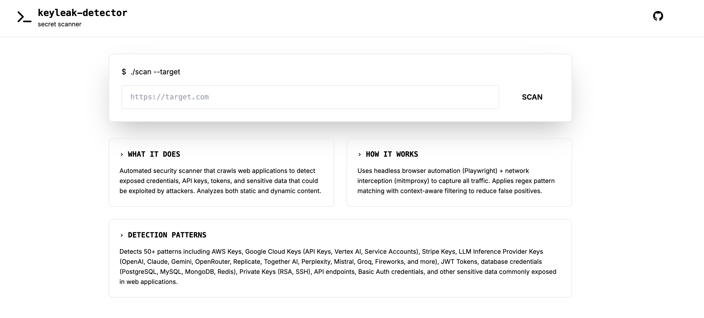

# KeyLeak Detector

[](https://github.com/Amal-David/keyleak-detector)
[](LICENSE)
[](https://www.python.org/)

A web application that scans websites for potential API keys, secrets, and sensitive information leaks. This tool helps developers and security professionals identify and fix security vulnerabilities in their web applications.

**Referenced Project:** Key detection patterns inspired by [Keyleaksecret](https://github.com/0xSojalSec/Keyleaksecret).

## 📸 Preview



## ⚠️ Disclaimer

**FOR EDUCATIONAL AND AUTHORIZED TESTING PURPOSES ONLY**

This tool is provided for educational purposes and authorized security testing only. By using this software, you agree to the following:

- **You may ONLY scan websites and applications that you own or have explicit written permission to test**
- **Unauthorized scanning of third-party websites may be illegal in your jurisdiction**
- **The authors and contributors are NOT responsible for any misuse or damage caused by this tool**
- **Users are solely responsible for ensuring compliance with all applicable laws and regulations**
- **This tool is provided "AS IS" without warranty of any kind, express or implied**
- **The authors assume NO liability for any consequences resulting from the use or misuse of this software**

By using KeyLeak Detector, you acknowledge that you have read, understood, and agreed to these terms. If you do not agree, do not use this tool.

## Features

- Scans web pages for common secret patterns (API keys, passwords, tokens, etc.)
- Checks response headers for sensitive information
- Validates security headers
- User-friendly web interface
- Real-time scanning results
- Categorizes findings by severity

## Installation

1. Clone this repository:
   ```bash
   git clone <repository-url>
   cd keyleak-detector
   ```

2. Create and activate a virtual environment (recommended):
   ```bash
   python -m venv venv
   source venv/bin/activate  # On Windows: venv\Scripts\activate
   ```

3. Install the required dependencies:
   ```bash
   pip install -r requirements.txt
   ```

4. Install Playwright browsers (required for scanning):
   ```bash
   playwright install chromium
   playwright install-deps
   ```

## Usage

1. Start the application:
   ```bash
   python app.py
   ```

2. Open your web browser and navigate to:
   ```
   http://localhost:5002
   ```
   
   > **Note:** The app runs on port 5002 instead of 5000 as port 5000 is commonly used by AirPlay on macOS.

3. Enter the URL you want to scan in the input field and click "Scan Now"

4. View the results, which will show any potential security issues found

## How It Works

The application uses a combination of browser automation and network traffic analysis to find secrets:

1. **Browser Automation**: Uses Playwright to load the target website in a headless browser
2. **Network Monitoring**: Intercepts HTTP requests and responses using mitmproxy
3. **Content Analysis**: Analyzes JavaScript, HTML, headers, and dynamic content
4. **Pattern Matching**: Uses regex patterns to detect various types of secrets
5. **Smart Filtering**: Filters false positives using context-aware analysis
6. **Categorization**: Groups findings by severity (Critical, High, Medium, Low)

## Patterns Detected

The scanner detects 50+ types of sensitive information including:

**Cloud Provider Credentials:**
- AWS Access Keys & Secret Keys
- Google API Keys & OAuth Tokens
- Google Cloud Service Account Keys
- Google Vertex AI API Keys
- Firebase API Keys
- Heroku API Keys

**Service Credentials:**
- Stripe API Keys
- Slack Tokens
- GitHub Tokens & OAuth
- GitLab Tokens
- Mailgun, Mailchimp, Twilio API Keys
- npm Tokens

**LLM/AI Inference Provider Keys:**
- OpenAI API Keys (GPT-4, ChatGPT, etc.)
- Anthropic API Keys (Claude)
- Google Gemini & Vertex AI API Keys
- Hugging Face Tokens
- Cohere API Keys
- OpenRouter API Keys
- Replicate API Keys
- Together AI API Keys
- Perplexity AI API Keys
- Mistral AI API Keys
- AI21 Labs API Keys
- Anyscale API Keys
- DeepInfra API Keys
- Groq API Keys
- Fireworks AI API Keys

**Database Credentials:**
- MongoDB, PostgreSQL, MySQL, Redis connection strings
- SQL Server connection strings

**Authentication:**
- JWT Tokens
- Bearer Tokens
- OAuth Tokens
- Session Tokens
- Basic Auth credentials
- API Keys

**Sensitive Data:**
- Private SSH Keys
- Credit Card Numbers
- Social Security Numbers
- Email Addresses
- Phone Numbers

**Other:**
- Webhook URLs
- Callback URLs
- Hardcoded passwords
- Encrypted credentials in JavaScript

## Findings and Recommendations

When the scanner detects potential secrets, it provides:

- **Severity classification** (Critical, High, Medium, Low)
- **Context information** showing where the secret was found
- **Actionable recommendations** for remediation
- **Best practices** for secure credential management

## Legal and Ethical Use

### Authorization Required
- ✅ **DO** scan your own websites and applications
- ✅ **DO** scan websites where you have explicit written authorization
- ✅ **DO** use for security research with proper permissions
- ✅ **DO** use for educational purposes in controlled environments
- ❌ **DON'T** scan websites without explicit permission
- ❌ **DON'T** use for malicious purposes
- ❌ **DON'T** share or exploit found credentials

### Best Practices
- Always obtain written permission before scanning any system
- Handle scan results securely and responsibly
- If you find valid credentials, rotate them immediately
- Report findings through responsible disclosure programs
- Be cautious when scanning production environments
- Understand and comply with applicable laws in your jurisdiction

### Liability
**THE AUTHORS AND CONTRIBUTORS OF THIS SOFTWARE DISCLAIM ALL LIABILITY FOR ANY MISUSE, DAMAGES, OR LEGAL CONSEQUENCES ARISING FROM THE USE OF THIS TOOL. USERS ASSUME FULL RESPONSIBILITY FOR THEIR ACTIONS.**

## Contributing

Contributions are welcome! Please feel free to:

1. Fork the repository: [https://github.com/Amal-David/keyleak-detector](https://github.com/Amal-David/keyleak-detector)
2. Create a feature branch (`git checkout -b feature/AmazingFeature`)
3. Commit your changes (`git commit -m 'Add some AmazingFeature'`)
4. Push to the branch (`git push origin feature/AmazingFeature`)
5. Open a Pull Request

## Issues and Support

Found a bug or have a feature request? Please open an issue on GitHub:
[https://github.com/Amal-David/keyleak-detector/issues](https://github.com/Amal-David/keyleak-detector/issues)

## License

This project is licensed under the MIT License - see the [LICENSE](LICENSE) file for details.

## Author

Created and maintained by [Amal David](https://github.com/Amal-David)

## Repository

**GitHub:** [https://github.com/Amal-David/keyleak-detector](https://github.com/Amal-David/keyleak-detector)
