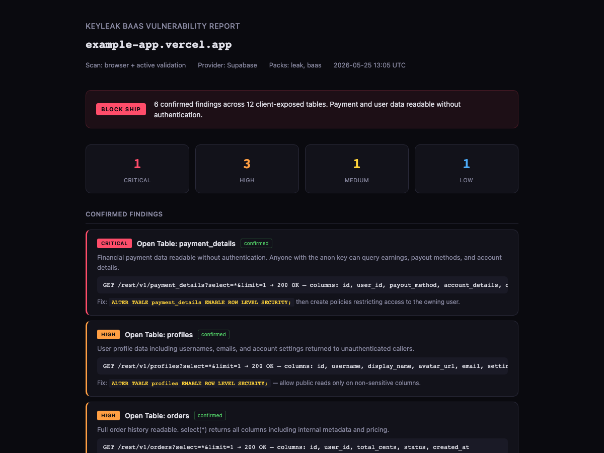

# KeyLeak Detector

[](https://pypi.org/project/keyleak-detector/)
[](https://github.com/Amal-David/keyleak-detector)
[](LICENSE)
[](docs/github-action.md)
[](extension/)
[](https://www.python.org/)

Runtime leak detector for modern web apps. Finds exposed API keys, **validates BaaS misconfigurations** (Supabase RLS, Firebase Security Rules), and catches secrets in JavaScript bundles -- with a Chrome extension for real-time detection.

## What Makes This Different

Static scanners find hardcoded secrets in source code. KeyLeak finds the ones that only appear at runtime -- and then **proves they're exploitable**.

- **BaaS vulnerability scanner**: Detects Supabase/Firebase/Appwrite config in minified JS bundles, extracts table names, and actively probes whether Row-Level Security is enforced. A Supabase anon key is harmless if RLS works. KeyLeak tests whether it does.
- **Chrome extension**: Detects leaked keys in real-time as you browse. TEST button validates whether a found key is still active (supports 14 providers). JWT decoder surfaces suspicious claims (service_role, admin flags, broad scopes).
- **Site scanner**: Discovers subdomains, crawls pages, scans everything. One command for a full site audit.
- **200+ first-party domain suppression**: No false positives when browsing Google, AWS, Azure, GitHub, Stripe, etc.

## Install

### PyPI (recommended)

```bash
pip install keyleak-detector
keyleak browser-scan https://your-app.vercel.app --html > report.html
```

Or with **uv** (faster):

```bash
uv pip install keyleak-detector
# or run directly without installing:
uvx keyleak-detector browser-scan https://your-app.vercel.app --html > report.html
```

### GitHub Action (CI/CD)

Add to any repo to scan preview deployments automatically:

```yaml
# .github/workflows/keyleak.yml
name: KeyLeak Security Scan
on: [deployment_status]

jobs:
  keyleak:
    if: github.event.deployment_status.state == 'success'
    runs-on: ubuntu-latest
    steps:
      - uses: actions/checkout@v4
      - uses: Amal-David/keyleak-detector@v0.5.0
        id: scan
        with:
          mode: browser
          url: ${{ github.event.deployment_status.target_url }}
          baas-validate: true
          fail-on: high
```

Works with **Vercel**, **Netlify**, **Render**, **Railway** — anywhere a preview URL is generated. See [full GitHub Action docs](docs/github-action.md) for all options, SARIF upload, and local-only scanning.

### Chrome Extension

```
1. Open chrome://extensions
2. Enable "Developer mode"
3. Click "Load unpacked" → select the extension/ folder
```

Browse any site. The extension icon shows a badge count for findings. Click to see details, TEST keys live, and view remediation.

### From Source

```bash
git clone https://github.com/Amal-David/keyleak-detector.git
cd keyleak-detector

# With poetry
poetry install && poetry run playwright install chromium

# Or with uv
uv sync && uv run playwright install chromium
```

## Usage

```bash
# Scan a single page
keyleak browser-scan https://your-app.vercel.app --html > report.html

# Scan with BaaS validation (tests Supabase RLS, Firebase rules)
keyleak browser-scan https://your-app.vercel.app --baas-validate --html > report.html

# Scan an entire site (subdomain discovery + page crawling)
keyleak site-scan example.com --depth 2 --baas-validate --html > report.html

# Scan local files for secrets
keyleak local . --fail-on high

# Output formats: --json, --sarif, --markdown, --html
```

### HTML Report

The `--html` flag generates a self-contained dark-theme vulnerability report:



## What It Detects

| Category | What | How |
|---|---|---|
| **BaaS misconfig** | Open Supabase tables, missing RLS, public storage buckets, callable RPCs | Active validation -- probes the REST API with only the anon key |
| **BaaS providers** | Supabase, Firebase, Appwrite, PocketBase | Config extraction from minified JS bundles |
| **API keys** | OpenAI, Anthropic, Gemini, Stripe, GitHub, AWS, and 20+ more | Regex detection + live TEST validation |
| **JWT analysis** | service_role exposure, admin flags, broad scopes, long expiry | Decode + claims analysis (no verification needed) |
| **Client-side auth** | `isAdmin === true` checks in browser JS | Pattern detection in bundles |
| **Write access** | Tables accepting INSERT/UPDATE without auth | `Prefer: tx=rollback` probing (never creates data) |
| **Auth config** | Missing email confirmation, exposed auth settings | Supabase auth endpoint probing |
| **Supply chain** | npm lifecycle hooks, Git-ref optionalDeps, Pwn Request patterns | AST + fingerprint detection |
| **Local files** | `.env`, MCP configs, CI workflows, Docker files, source maps | `keyleak local` scanner |

## Chrome Extension Features

- **Real-time BaaS detection**: Intercepts Supabase/Firebase API requests and probes RLS live
- **TEST button**: Validates keys against 14 providers (Gemini, OpenAI, Anthropic, GitHub, Stripe, Groq, etc.)
- **JWT decoder**: Click TEST on any JWT to see decoded claims with severity flags
- **Finding grouping**: Same key in multiple scripts = one card with clickable source URLs
- **AIza classification**: Distinguishes Google Maps keys (expected) from Gemini AI keys (leaked)
- **87 vendor CDN suppression**: No false positives from Google Analytics, PostHog, Segment, etc.
- **200+ first-party domains**: Google, Microsoft, AWS, Apple, Meta, Anthropic, Stripe -- their own keys on their own sites are never flagged

## v0.5.0 -- What's New

- **BaaS vulnerability scanner** with active validation (Supabase, Firebase, Appwrite, PocketBase)
- **Chrome extension** with real-time detection, TEST button, and JWT analysis
- **Site scanner CLI** (`keyleak site-scan`) with subdomain discovery
- **HTML report** output (`--html`)
- **20 new `baas` pack detectors**
- **Comprehensive false positive suppression** (200+ first-party domains, 87 vendor CDNs, cloud storage URLs, infra headers)

## False Positives

The Chrome extension suppresses findings from 200+ first-party domains (Google, AWS, Azure, GitHub, Stripe, etc.), 87 vendor CDN scripts, cloud storage signed URLs, and infrastructure headers. Despite this, you may encounter false positives on sites we haven't seen yet.

**If you find a false positive, please report it.** Open an issue with:
- The finding type (e.g., "GEMINI API KEY", "SQL INJECTION")
- The source (e.g., "External Script: cdn.example.com/lib.js")
- Why it's a false positive (e.g., "This is the vendor's own key in their CDN script")

We actively review reported FPs and add suppression rules. The more sites you browse with the extension, the better the suppression gets.

## The Delta Four Result

Every serious scan should lead to four things:

- `Verdict`: `SAFE TO SHIP`, `REVIEW`, or `BLOCK SHIP`.
- `Proof`: redacted evidence, source, detector, and confidence.
- `Fix`: exact remediation and rotation guidance.
- `Re-test`: the command or profile to run after fixing.

Example CLI result:

```bash
keyleak scan https://preview.example.com
BLOCK SHIP: 1 critical, 0 high, 2 medium, 3 low
Critical or high-confidence exposures need fixing before release.
Re-test: keyleak scan https://preview.example.com
```

## What It Checks

| Area | Status | Notes |
|---|---:|---|
| Runtime JS/API response secrets | Strong | Browser + proxy capture scans scripts, headers, URLs, and responses. |
| AI/LLM provider keys | Strong | OpenAI, Anthropic, Gemini, OpenRouter, Groq, Hugging Face, and more. |
| Cloud/SaaS/PAT/webhooks | Strong | AWS, GitHub, Stripe, Slack, SendGrid, PyPI, database URLs, private keys. |
| Auth-only leaks | Partial | Authenticated bearer/cookie scan support exists; two-user comparison is available with explicit second-user credentials. |
| SQLi/XSS/auth bypass leads | Opt-in | `appsec` pack labels these as leads until exploit validation exists. |
| IDOR/BOLA hints | Improved | Flags direct object references and can validate with two explicit user contexts. |
| Attack surface | Partial | Security headers, TLS, exposed files, admin paths, subdomain enumeration. |
| Local config leaks | New | `keyleak local` scans `.env`, MCP, CI, Docker, source maps, and logs. |
| Correctness/housekeeping | Opt-in | `correctness` and `housekeeping` packs catch N+1, regressions, off-by-one/date/config leads, missing tests, dead code, and stale docs. |
| Source maps/debug bundles | New | Local scanner detects source map content and provider keys. |
| GraphQL/LLM/agent hints | Early | Local detectors catch GraphQL introspection and prompt-injection-style text. |

KeyLeak is not a full DAST, not exploit automation, and not a replacement for GitLeaks, TruffleHog, GitHub secret scanning, or GitGuardian. It is the runtime/browser/local-config layer that complements them.

## How To Use It Now

Use the surface that matches your workflow.

### 1. Run The Web UI With Docker

This is the fastest way to try the browser scanner without installing Python dependencies locally.

```bash
git clone https://github.com/Amal-David/keyleak-detector.git
cd keyleak-detector
docker compose up -d
```

Open `http://localhost:5002`.

Use the page input for a basic runtime scan. Use the authenticated scan modal only with throwaway test credentials.

### 2. Run The Web UI Locally

Use this path when you want to develop the Flask app, scanner, templates, CSS, or JavaScript.

```bash
poetry install
poetry run playwright install chromium
poetry run python app.py
```

Open `http://localhost:5002`.

If you do not use Poetry, create a virtual environment and install the package locally:

```bash
python3.12 -m venv .venv
source .venv/bin/activate
pip install -r requirements.txt
pip install -e .
python -m playwright install chromium
python app.py
```

### 3. Scan Local Files And Configs

Use `keyleak local` before pushing or shipping. It scans local files without starting the web app.

```bash
poetry install
poetry run keyleak local fixtures/vulnerable-demo
poetry run keyleak local . --json
poetry run keyleak local . --sarif --fail-on high
```

By default, local mode includes `env,mcp,ci,docker,sourcemaps,logs`.

Limit the scan to specific file families:

```bash
poetry run keyleak local . --include env,mcp,sourcemaps
```

Detector packs control the kind of failure patterns to look for. CLI/web default to `leak`; the extension default uses `leak,appsec,access-control`.

```bash
poetry run keyleak local . --packs leak,appsec,access-control --json
poetry run keyleak local . --launch-profile full --markdown
poetry run keyleak local . --launch-profile ci --fail-on high
```

Exit codes are designed for automation: `0` means the selected threshold passed, `1` means the command failed, and `2` means findings met `--fail-on`.

### 4. Scan A Running Web App From The CLI

Use `keyleak scan` when you have a preview URL, staging URL, or local app URL.

The CLI talks to the local KeyLeak web scanner API, so start the web app first:

```bash
poetry run python app.py
poetry run keyleak scan https://preview.example.com --json
poetry run keyleak scan https://preview.example.com --bearer "$TOKEN" --fail-on medium
```

You can also point the CLI at the Docker web scanner:

```bash
docker compose up -d
poetry run keyleak scan http://host.docker.internal:3000 --server http://127.0.0.1:5002
```

### 5. Run Authenticated Scans

Use authenticated mode only against systems you own or have permission to test.

```bash
poetry run keyleak scan https://preview.example.com \
  --profile authenticated \
  --bearer "$THROWAWAY_TOKEN"
```

Use a cookie instead of a bearer token:

```bash
poetry run keyleak scan https://preview.example.com \
  --profile authenticated \
  --cookie "session=throwaway-session"
```

Use both when the app requires both:

```bash
poetry run keyleak scan https://preview.example.com \
  --profile authenticated \
  --bearer "$THROWAWAY_TOKEN" \
  --cookie "session=throwaway-session"
```

For access-control checks, provide a second throwaway user explicitly. KeyLeak will compare object-looking URLs as user A and user B and mark same-access evidence as validated:

```bash
poetry run keyleak scan https://preview.example.com/users/123456 \
  --profile authenticated \
  --launch-profile bug-bounty \
  --packs access-control \
  --bearer "$USER_A_TOKEN" \
  --bearer-b "$USER_B_TOKEN"
```

### 6. Generate Reports For CI Or Review

Use JSON for baselines, SARIF for code scanning systems, and Markdown for human review.

```bash
poetry run keyleak local . --json > keyleak-report.json
poetry run keyleak local . --sarif > keyleak.sarif
poetry run keyleak local . --markdown > keyleak-report.md
```

Fail on high or critical findings:

```bash
poetry run keyleak local . --fail-on high
poetry run keyleak scan https://preview.example.com --fail-on critical
```

Suppress known findings with a previous JSON report or allowlist:

```bash
poetry run keyleak local . --baseline keyleak-report.json
poetry run keyleak local . --allowlist keyleak-allowlist.txt
```

The default launch profile is `launch-gate`, which blocks on high and critical findings while keeping lower-severity hardening notes visible for review:

```bash
poetry run keyleak local . --launch-profile launch-gate --fail-on high --json > keyleak-report.json
```

The repository includes a GitHub Actions launch gate at `.github/workflows/keyleak-launch-gate.yml` that runs the local scanner and uploads a JSON report artifact.

### 7. Use With Claude Code / Codex

The repo ships an agent skill at `.claude/skills/keyleak-verify/SKILL.md`. In any Claude Code session inside this repo, prompts like:

```text
Is this build safe to ship?
Run a launch-gate check on the preview URL https://preview.example.com.
Scan the current branch for leaked secrets before I deploy.
```

trigger the skill. The agent then chooses between `keyleak local` and `keyleak scan`, picks the right `--launch-profile` and `--fail-on` threshold, interprets the verdict JSON, and reports back with `BLOCK SHIP` / `REVIEW` / `SAFE TO SHIP` plus the top blocking findings and a re-test command. The skill respects the local-first trust model: it only scans systems you own, never auto-suppresses findings, and never echoes raw secret values back.

## Safe Demo

The repo includes an intentionally vulnerable local fixture:

```bash
poetry run keyleak local fixtures/vulnerable-demo --markdown
```

This gives contributors and Hacker News readers a safe way to see a `BLOCK SHIP` result without scanning random systems.

## Web Scanner

Basic scan:

1. Loads the target in headless Chromium through mitmproxy.
2. Captures URLs, headers, responses, inline scripts, and DOM config data.
3. Applies custom and GitLeaks-derived secret patterns.
4. Runs attack-surface checks for exposed files, security headers, admin paths, TLS, and subdomains.
5. Returns a verdict, summary, findings, proof, fix guidance, and re-test command.

Authenticated scan:

1. Adds a throwaway bearer token and/or cookie to the browser context.
2. Scans authenticated pages and traffic.
3. Applies best-effort access-control heuristics for direct object references.

Use throwaway credentials only.

## Chrome Extension

The `extension/` folder contains an experimental local Chrome extension that passively monitors pages as you browse.

It scans:

- request and response headers
- URLs and query parameters
- fetch/XHR response bodies
- inline scripts
- data attributes and page config

### Load It In Chrome

The extension is not published to the Chrome Web Store yet. Load it from this repo:

1. Clone or pull the latest `main` branch.
2. Open `chrome://extensions` in Chrome.
3. Enable `Developer mode`.
4. Click `Load unpacked`.
5. Select the `extension/` folder, not the repository root.
6. Pin `KeyLeak Detector` from the Chrome toolbar extensions menu.
7. Browse an app you own or have permission to test.
8. Click the KeyLeak toolbar icon to see findings for the current tab.

The exact folder to select is:

```text
keyleak-detector/extension
```

### Use The Popup

The popup shows:

- a badge count for findings on the current tab
- a launch verdict: `SAFE TO SHIP`, `REVIEW`, or `BLOCK SHIP`
- severity filters for `CRIT`, `HIGH`, `MED`, and `LOW`
- scan activity stats for headers, fetch/XHR bodies, external scripts, source maps, storage, WebSocket/SSE messages, data attributes, and meta tags
- redacted proof, detector IDs, confidence, validation status, and fix guidance
- report copy actions for redacted JSON and Markdown
- per-finding suppression by stable finding ID for known launch-gate noise
- a `RUN FULL SCAN` action that calls the local KeyLeak web scanner at `http://127.0.0.1:5002` without forwarding browser cookies or bearer tokens
- a `CLEAR` button to reset findings for the current tab

### Use The DevTools Panel

Open Chrome DevTools on a page, then select the `Secrets` panel. It shows a wider launch-gate table and enables DevTools network body capture while the panel is open, which improves coverage for parser-loaded bundles and source maps.

### Learn And Reference Tabs

Both the popup and the DevTools panel include a `Findings` tab and a `Reference` tab:

- Click `LEARN` on any finding to inline-expand a panel explaining what the detector is, why it matters, the canonical attack scenario, the fix, and external references (OWASP, CWE, vendor docs).
- Switch to `Reference` to browse every detector grouped by pack (`leak`, `appsec`, `access-control`, `correctness`, `housekeeping`). The search box filters by detector ID, description, remediation, or category. Use this as a glossary even when there are no findings.

Detector educational content is sourced from `keyleak/detectors.py` (`description`, `remediation`, `references`, optional `attack_scenario`) and regenerated into `extension/lib/detector-info.js` by `scripts/generate_extension_patterns.py`. To add or improve an explanation, edit the detector and re-run the script.

### Extension Permissions

The extension requests `webRequest`, `storage`, `activeTab`, `tabs`, and `<all_urls>` because it observes requests, headers, page content, and fetch/XHR responses locally.

Use it for development, staging, bug bounty scopes, or owned systems. Disable it when browsing unrelated sensitive sites. See [docs/SECURITY_MODEL.md](docs/SECURITY_MODEL.md) before using it on sensitive browsing sessions.

## Reports

CLI output formats:

```bash
poetry run keyleak local . --json
poetry run keyleak local . --markdown
poetry run keyleak local . --sarif
poetry run keyleak scan https://preview.example.com --baseline keyleak-baseline.json --fail-on high
```

Each normalized finding includes:

- `id`
- `type`
- `severity`
- `confidence`
- `detector_id`
- `category`
- `source`
- `evidence`
- `redacted_value`
- `risk_reason`
- `remediation`
- `references`
- `validation_status`

Reports also include `packs` and `pack_summary`, so web, CLI, CI, and extension exports can group findings by heatmap category.

Baselines and allowlists are intentionally simple. A baseline can be a previous KeyLeak JSON report; those finding IDs/signatures are suppressed so CI fails only on new findings. An allowlist can be JSON (`ids`, `detector_ids`, `types`, `source_contains`) or a line file using entries like `id:finding_...`, `detector:local:openai_api_key`, `type:source_map_reference`, or `source:fixtures/vulnerable-demo`.

## Security Model

- Local-first: scans run on your machine or self-hosted Docker container.
- No hosted credential upload is required.
- Values are redacted in normalized reports by default.
- Authenticated scans should use throwaway test credentials.
- Only scan systems you own or have explicit permission to test.

Read [docs/SECURITY_MODEL.md](docs/SECURITY_MODEL.md) for details and limits.

## Contributing

Useful PRs are very welcome. The best contribution lanes are:

- add provider patterns with fixtures
- add safe vulnerable fixtures
- improve false-positive handling
- add remediation playbooks
- improve Chrome extension UX or tests
- add report exporters
- improve CLI profiles and CI behavior
- add MCP/agent/LLM leak detectors
- add detector-pack fixtures and lower-noise validators for correctness and housekeeping leads

Start with [CONTRIBUTING.md](CONTRIBUTING.md) and [docs/DETECTOR_AUTHORING.md](docs/DETECTOR_AUTHORING.md).

## Roadmap

- Shared scanner core for web UI, CLI, and extension.
- More detector fixtures and report tests.
- More validated appsec checks beyond lead detection.
- GraphQL, OAuth/OIDC, CORS, source-map, and agent-web safety detectors.

## Responsible Use

Only scan systems you own or have written permission to test. Unauthorized scanning may be illegal. Handle findings securely, rotate exposed credentials immediately, and report vulnerabilities through responsible disclosure.

## Acknowledgments

- [GitLeaks](https://github.com/gitleaks/gitleaks) for the industry-standard secret scanning rules that KeyLeak imports.
- [Keyleaksecret](https://github.com/0xSojalSec/Keyleaksecret) for additional pattern inspiration.

## License

MIT. See [LICENSE](LICENSE).
