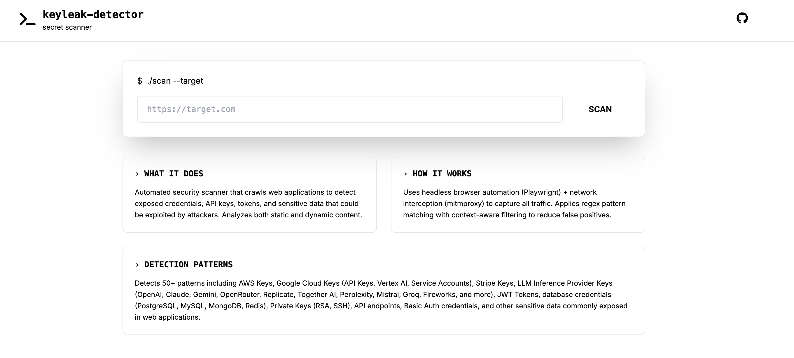

# KeyLeak Detector

[](https://github.com/Amal-David/keyleak-detector)
[](LICENSE)
[](https://www.python.org/)

A web application that scans websites for exposed API keys, secrets, sensitive data, and access control issues. Combines headless browser automation with network traffic interception to catch secrets in JavaScript, headers, API responses, and dynamic content.

Detection patterns are dynamically loaded from [GitLeaks](https://github.com/gitleaks/gitleaks) and enhanced with custom patterns optimized for runtime web scanning.

## Preview



## Features

- **200+ Detection Patterns** — Dynamic pattern loading from GitLeaks combined with custom patterns, cached for 24 hours
- **Two Scan Modes** — Unauthenticated basic scan and authenticated extensive scan with Bearer token / cookie support
- **Access Control Detection** — Identifies potential IDOR and broken access control patterns on object-level endpoints, with confidence-based severity scoring
- **Attack Surface Analysis** — Subdomain enumeration, missing security headers, exposed files (`.env`, `.git`), TLS issues, admin endpoints, technology fingerprinting
- **Real-Time Progress** — Server-Sent Events stream scan progress to the UI as it happens
- **Smart False Positive Filtering** — Context-aware filtering for CSS, JavaScript builtins, placeholder values, and common non-secrets
- **Severity Filtering** — Results sorted by severity with clickable filter toggles to focus on what matters

## Quick Start

### Docker (Recommended)

```bash
git clone https://github.com/Amal-David/keyleak-detector.git
cd keyleak-detector
docker compose up -d
```

Open **http://localhost:5002** in your browser.

```bash
docker compose logs -f          # View logs
docker compose up -d --build    # Rebuild after changes
docker compose down             # Stop
```

**Requirements:** Docker 20.10+, Docker Compose 2.0+, 2GB RAM, 1GB disk (~690MB image)

For detailed Docker instructions, see [DOCKER.md](DOCKER.md).

### Manual Installation

```bash
git clone https://github.com/Amal-David/keyleak-detector.git
cd keyleak-detector

# Install dependencies (choose one)
poetry install                    # Poetry
uv pip install -r requirements.txt  # UV

# Install browser (required)
playwright install chromium
# Linux only: playwright install-deps chromium

# Run
python app.py
```

Open **http://localhost:5002**. The app uses port 5002 to avoid conflict with AirPlay on macOS.

## Scanning

### Basic Scan

Enter a URL and click **BASIC SCAN**. This runs an unauthenticated scan that:

1. Loads the page in a headless browser through an intercepting proxy
2. Captures all HTTP requests and responses
3. Analyzes inline scripts, data attributes, headers, and API responses
4. Runs attack surface checks (subdomains, security headers, exposed files, TLS)
5. Returns findings sorted by severity

### Extensive Scan (Authenticated)

Click the **EXTENSIVE SCAN** button, provide a throwaway Bearer token and/or cookie, then run. This adds:

- Authenticated browsing with your credentials injected into the session
- IDOR detection — flags endpoints where object IDs in the URL don't match the authenticated user's identity (extracted from JWT claims)
- Confidence-based severity — GET requests to public-looking endpoints default to medium; mutating methods (PUT/DELETE) with success responses escalate to high

> Only use throwaway / non-production credentials for authenticated scanning.

### Attack Vector Settings

Optional configuration via environment variables:

| Variable | Default | Description |
|---|---|---|
| `SCAN_TIME_BUDGET_SECONDS` | `600` | Time limit for attack surface scanning |
| `SUBDOMAIN_ENUMERATOR` | `subfinder` | Preferred tool (`subfinder` or `amass`) |
| `SUBDOMAIN_PROXY` | — | HTTP proxy for the enumerator |
| `HTTP_PROXY` / `HTTPS_PROXY` | — | Outbound request routing |

## How It Works

1. **Browser Automation** — Playwright loads the target in a headless Chromium instance
2. **Network Interception** — mitmproxy captures all HTTP/HTTPS traffic as a man-in-the-middle proxy
3. **Content Analysis** — Parses JavaScript, HTML, headers, JSON responses, and dynamic content
4. **Pattern Matching** — 200+ compiled regex patterns detect secrets across all captured content
5. **Access Control Analysis** — Detects IDOR patterns by comparing URL object IDs against JWT subject claims
6. **Smart Filtering** — Multi-layer false positive filtering (CSS patterns, JS builtins, placeholders, reserved IPs)
7. **Real-Time Progress** — SSE streams scan status to the frontend as each phase completes

## Patterns Detected

**Cloud & Infrastructure:** AWS Keys, Google API/OAuth/Service Account Keys, Firebase, Heroku, Vertex AI

**Services:** Stripe, Slack, GitHub (PAT + fine-grained), GitLab, npm, SendGrid, Square, Mailgun, Mailchimp, Twilio, PyPI

**AI/LLM Providers:** OpenAI, Anthropic, Gemini, Hugging Face, Cohere, OpenRouter, Replicate, Together AI, Perplexity, Mistral, AI21, Groq, Fireworks, DeepInfra, Anyscale

**Databases:** MongoDB, PostgreSQL, MySQL, Redis, SQL Server connection strings

**Authentication:** JWT, Bearer, OAuth, session tokens, Basic Auth, API keys

**Sensitive Data:** Private SSH keys, credit card numbers, SSNs, hardcoded passwords, encrypted credentials in JavaScript

**Access Control:** IDOR patterns, broken access control on object-level endpoints

## Responsible Use

Only scan systems you own or have written permission to test. Unauthorized scanning may be illegal in your jurisdiction. Handle findings securely, rotate any exposed credentials immediately, and report through responsible disclosure programs.

This tool is provided under the MIT License without warranty. See [LICENSE](LICENSE) for details.

## Acknowledgments

- **[GitLeaks](https://github.com/gitleaks/gitleaks)** — Industry-standard SAST tool. We dynamically import their pattern database.
- **[Keyleaksecret](https://github.com/0xSojalSec/Keyleaksecret)** — Additional pattern inspiration.

## Contributing

1. Fork the repository
2. Create a feature branch (`git checkout -b feature/amazing-feature`)
3. Commit your changes
4. Push and open a Pull Request

Issues and feature requests: [GitHub Issues](https://github.com/Amal-David/keyleak-detector/issues)

## Author

Created by [Amal David](https://github.com/Amal-David)
